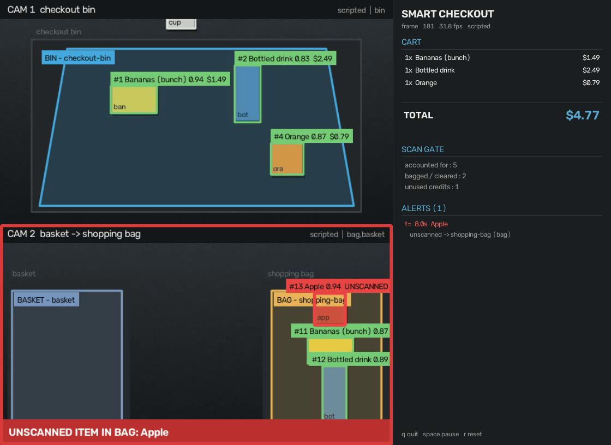

# CIS-5810-Final-Project

This project uses computer vision to improve two important grocery store checkout processes. Firstly, we want to be able to detect which objects are placed in a "checkout bin" in order to help a user check out without manually scanning each item. An example of an existing product with similar functionality would be Uniqlo’s smart check out system. Secondly, we would like to create a feature that recognizes when an object is moved out of the "basket” and moved into the “shopping bag” without being scanned or paid for. At a high level, we plan to do this by checking if an item is placed into one camera field of view without passing through another camera field of view.

---

## MVP

A runnable version of both features. One pipeline, any number of cameras, a live
cart and a live alert feed.



**Auto-checkout** — items that settle inside a `bin` zone are recognized, priced
from a catalog and added to the cart. Take one back out and its line comes off.

**Scan-gate loss prevention** — items that reach a `bag` zone raise an alert
unless they were accounted for first, either by passing a `scan` zone or by being
priced in the bin. The check works *across cameras*: the bin camera mints a
credit, the bagging camera spends it, which is exactly the "placed into one
camera field of view without passing through another" test from the brief.

## Install

Python 3.10–3.12 (ultralytics pulls in torch, which lags the newest Python).

```bash
conda create -n cis5810final python=3.11 -y
conda activate cis5810final
pip install -r requirements.txt
```

## Run it

### 1. The offline demo — no camera, no weights, no network

```bash
python run.py demo --run
```

This synthesizes two camera feeds plus their ground-truth tracks, then plays the
whole pipeline over them. A banana, a bottle and an orange go into the bin and
get priced; a cup goes in and is lifted back out, so its line is removed *and*
its scan credit is revoked; over on the bagging camera the banana and bottle
clear, and an apple that the bin camera never saw trips the alert.

```
--- receipt --------------------------------------------
  1x Bananas (bunch)                 $1.49
  1x Bottled drink                   $2.49
  1x Orange                          $0.79
  TOTAL                              $4.77

--- loss prevention: 1 alert(s) ------------------------
  t=  7.95s  Apple (track 13 on bag) -> entered the bag without passing a scan zone
```

Headless, for a graded artifact rather than a window:

```bash
python run.py demo --run --no-display --save out/demo.mp4 --report out/report.json
```

### 2. Your webcam

```bash
python run.py run --config configs/webcam-single.json
```

The left half of the frame is the checkout bin, the right half is the shopping
bag. Hold a bottle, cup, book, phone, scissors or piece of fruit in the left half
until it is priced, then move it right — it clears. Move something straight into
the right half without dwelling on the left and you get an alert.

`configs/webcam-lane.json` is the other arrangement: basket → scanner → bag
across the frame, with no auto-pricing.

Zones rarely match someone else's desk, so redraw them on a frame from your own
camera:

```bash
python run.py zones --config configs/webcam-single.json
```

Click the corners, press <kbd>Enter</kbd> to close the polygon, pick a role
(<kbd>1</kbd> bin, <kbd>2</kbd> basket, <kbd>3</kbd> scan, <kbd>4</kbd> bag),
then <kbd>s</kbd> to save back into the config.

### 3. Recorded video

```bash
python run.py run --config configs/webcam-single.json --source path/to/clip.mp4
```

Keys while running: <kbd>q</kbd> quit, <kbd>space</kbd> pause, <kbd>r</kbd> reset
the session, <kbd>p</kbd> save a snapshot.

Useful flags: `--backend yolo|scripted`, `--model yolo11s.pt`, `--conf 0.5`,
`--device cpu|0|mps`, `--speed 0` (as fast as possible), `--loop`,
`--max-frames N`, `--no-display`, `--save out.mp4`, `--report out.json`.

`python run.py check --config <cfg>` validates a config and prints what it
declares, which is the fastest way to find a bad path or a missing zone.

## How it works

```
frame ─► detector ─► tracker ─► zone coverage ─► debounce ─► events ─┬─► cart
        (YOLO)     (ByteTrack)  (integral image)  (hysteresis)        └─► scan gate
```

| Stage | File | What it does |
| --- | --- | --- |
| Detection + tracking | `src/smartcheckout/detect.py` | Ultralytics YOLO with ByteTrack, restricted to the catalog's classes. `ScriptedDetector` replays recorded boxes so everything downstream can run with no model. |
| Zones | `src/smartcheckout/zones.py` | Polygons in normalized coordinates, so a config survives a resolution change. Each polygon is rasterized once per frame size and queried through an integral image, which makes "what fraction of this box is inside?" exact for concave zones and O(1) per box. |
| Debouncing | `src/smartcheckout/zonestate.py` | An object must clear `confirm_frames` to count as inside a zone and `exit_frames` to count as out; a track that disappears is held for `lost_frames` first. Class labels are a majority vote over the track's life, not the current frame. |
| Cart | `src/smartcheckout/checkout.py` | Bin entries add priced lines, bin exits remove them. Unrecognized classes are added as flagged lines rather than silently dropped. |
| Scan gate | `src/smartcheckout/lossprev.py` | Clears a bagged item by track identity first, then by a shared per-class credit ledger. |
| Rendering | `src/smartcheckout/viz.py` | Zone overlay, box states, cart panel, alert banner. OpenCV only. |

### Why two clearance checks

Track identity is exact but fragile: ids switch under occlusion and do not
survive a move between cameras at all. The credit ledger is the robust fallback
— the bin camera adds one credit for "bottle", and the first bottle that reaches
a bag spends it. Identity is tried first so that credits are not burned when the
tracker did its job, and a credit clears exactly one item, so bagging two bottles
after scanning one still alerts on the second.

Taking an item back out of the bin revokes its credit, which closes the obvious
hole: bin an item, lift it out, walk it into the bag on a stale credit.

## Configuration

A config is one JSON file: a catalog, detector settings, tuning, and a list of
cameras each with a source and its zones.

```jsonc
{
  "catalog": "catalog.json",
  "detector": { "model": "yolo11n.pt", "min_conf": 0.4, "imgsz": 640 },
  "tuning": {
    "coverage_threshold": 0.3,   // fraction of the box that must be inside a zone
    "confirm_frames": 5,         // frames before an entry counts
    "exit_frames": 8,            // frames before an exit counts
    "lost_frames": 45            // frames a vanished track holds its zones
  },
  "cameras": [{
    "id": "lane",
    "source": "0",               // webcam index, video path, or rtsp/http url
    "zones": [
      { "name": "checkout-bin", "role": "bin",
        "polygon": [[0.03,0.22],[0.45,0.22],[0.45,0.95],[0.03,0.95]] }
    ]
  }]
}
```

Roles are `bin`, `basket`, `scan` and `bag`. `basket` is observed but does not
gate anything on its own — an item is judged at the moment it reaches a bag.

`configs/catalog.json` maps detector class names to SKUs and prices. The stock
weights predict COCO classes, so the shipped catalog prices COCO objects. Moving
to real product classes means retraining the detector and rewriting this one
file; nothing downstream changes.

## Tests

```bash
pytest
```

27 tests: zone coverage geometry (including concave zones), debounce hysteresis,
track loss, cart add/remove/grouping, every branch of the scan gate, and an
end-to-end run of the generated demo that asserts the $4.77 receipt and exactly
one alert on the apple.

## What this MVP does not do yet

- **Product classes are COCO classes.** The stock detector knows "bottle", not
  "Diet Coke 12oz". Real deployment needs a product-level detector or a detector
  plus an embedding classifier; the catalog file is the seam where that plugs in.
- **No cross-camera re-identification.** Items are matched across cameras by
  class, not appearance. Two shoppers bagging the same product at the same moment
  can trade credits. Appearance embeddings or a calibrated overlap between the
  views would fix this.
- **No calibration.** Zones are drawn in image space, so a camera that moves
  needs its zones redrawn.
- **Occlusion by hands** is handled only by debouncing, not modeled.
- **Counting is per-item.** Weighed goods and multipacks are out of scope.
